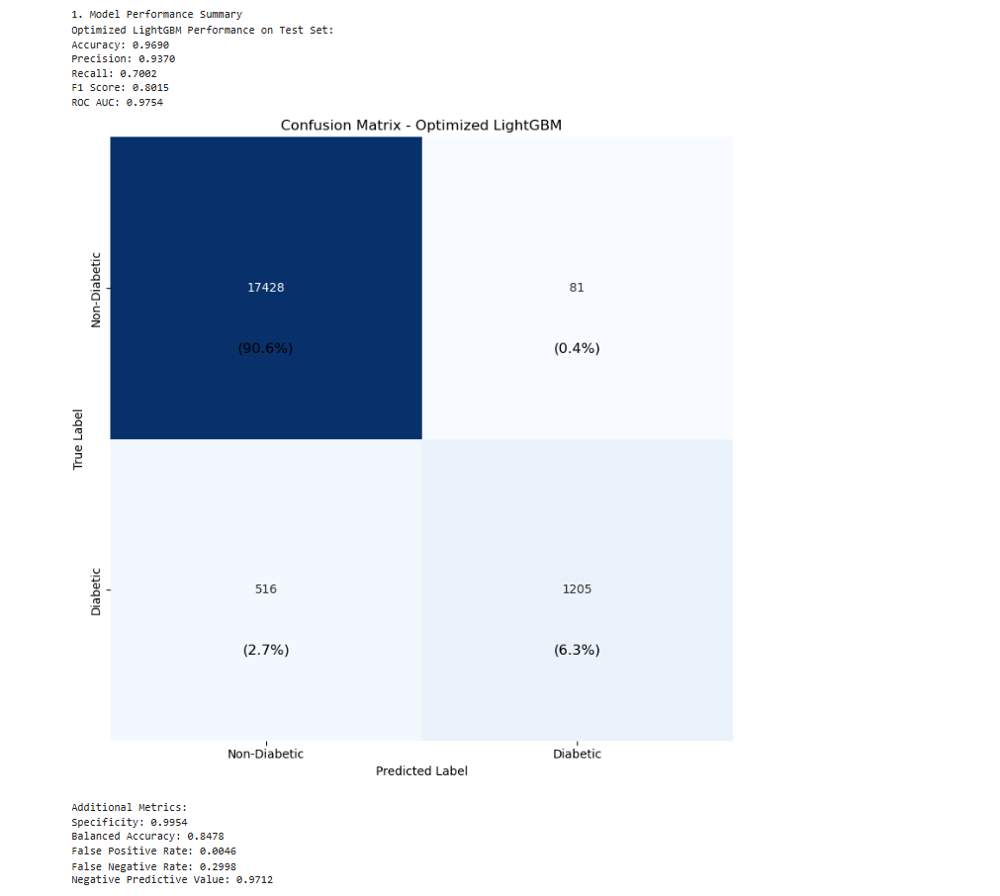

# 🩺 Diabetes Risk Prediction  
Machine Learning Classification Project  

Predicting diabetes risk using demographic and health indicators to support early detection and preventative healthcare strategies.

---

## 🌍 Problem Context

Diabetes affects over 589 million adults worldwide and is projected to impact 853 million by 2050. Delayed diagnosis contributes to severe complications and increased healthcare costs exceeding $1 trillion annually.

Early detection through predictive modeling can:
- Improve preventative care
- Reduce long-term healthcare expenditure
- Enable proactive patient intervention

---

## 🎯 Objective

Build and compare machine learning models to accurately predict diabetes diagnosis based on patient health and lifestyle attributes.

---

## 📊 Dataset

- Structured health dataset
- No missing values
- Duplicates removed
- Combination of categorical and numerical features

Target variable:
- `diabetes`

---

## ⚙️ Methodology

### Data Preprocessing
- RobustScaler for numerical features
- One-Hot Encoding for categorical features
- SMOTE for handling class imbalance
- Train/Test split

---

### Models Evaluated
- Logistic Regression
- Decision Tree
- Random Forest
- XGBoost
- LightGBM

---

## 🏆 Final Model

**Optimized LightGBM**

Tree-based ensemble models significantly outperformed linear and distance-based models.

---

## 📈 Performance

- Cross-validation performed
- ROC curve comparison across top models
- Optimized LightGBM delivered best test performance
- Strong precision-recall balance

## 📊 Model Evaluation

### ROC Curve Comparison

### Feature Importance

### Confusion Matrix

---

## 🔍 Key Insights

- Blood glucose level shows strongest association with diabetes
- Age demonstrates moderate predictive power
- BMI contributes but with weaker correlation compared to glucose
- Ensemble boosting methods improve predictive stability

---

## 🛠 Tech Stack

- Python
- Pandas & NumPy
- Scikit-learn
- LightGBM
- XGBoost
- SMOTE (Imbalanced-learn)
- Matplotlib & Seaborn

---

## 📂 Repository Structure
├── notebooks/

├── data/

├── assets/

└── README.md

---

## 👩🏽‍💻 Authors

Mayadir Sandoval  
Mariama Cham  
Sandra Soy Kipsang

---

